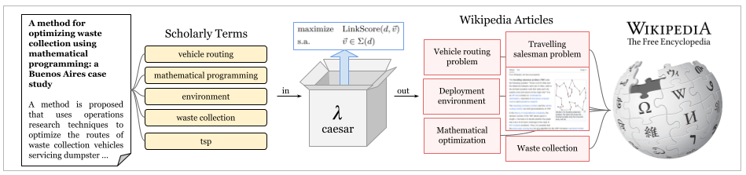

# caesar
**C**omprehensible and **A**utomated **E**ntity Linking of **S**cholarly Terms for **A**cademic **R**epresentation
## Overview

> **Figure 1:** Overview of CAESAR.



## How to cite?
```
@misc{caesar2023,
  author = {Urrutia, F.},
  title = {CAESAR},
  year = {2023},
  publisher = {GitHub},
  journal = {GitHub repository},
  howpublished = {\url{https://github.com/furrutiav/caesar}},
  commit = {}
}
```
